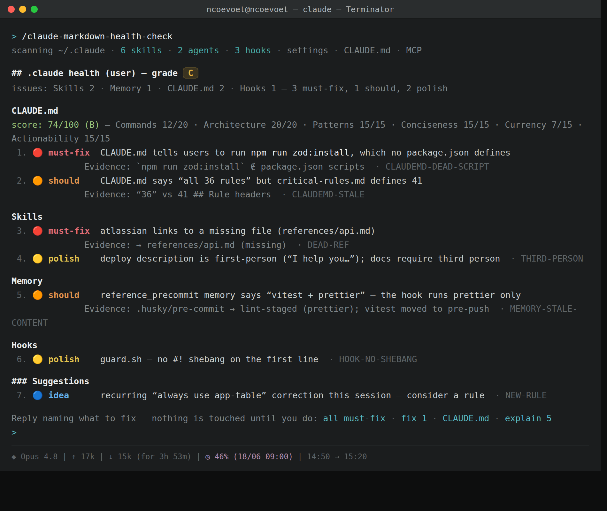

# /claude-markdown-health-check

[](https://github.com/ncoevoet/claude-markdown-health-check/actions/workflows/ci.yml)
[](.claude-plugin/plugin.json)
[](LICENSE)
[](https://code.claude.com/docs/en/plugins)

**Tracks the live Claude Code spec** — thresholds are fetched from the official docs and cached weekly, so the audit never drifts from the product.

A `.claude/` ecosystem auditor for [Claude Code](https://code.claude.com/docs/en/overview). One slash command scans your skills, commands, hooks, agents, settings, plugins, and auto-memory — across both the user tree (`~/.claude`) and the project tree (`./.claude`) — and prints one flat, prioritized health report. 

It finds dead references, weak or mismatched triggers, token bloat, skill-listing-budget overflow, frontmatter violations, dormant skills, failing hooks, drifted permissions, dead memory links, and per-session context bloat.

It reports first and waits. Nothing is edited, moved, or deleted until you reply naming which findings to fix — that autonomy gate is built into the command.

## Demo

> _Demo coming soon._ Run `/claude-markdown-health-check` to see the scorecard and area-grouped findings render in your own terminal.

<!-- TODO(demo): capture a screenshot/GIF of a real report (scorecard + grouped findings) into docs/demo.png and replace the note above with:  -->

## What it checks

| Area | Examples of findings |
|---|---|
| **Skills** | missing or oversized `description`, frontmatter `name` ≠ directory, triggers that don't match real usage, oversized `SKILL.md` with no `references/`, missing Examples / Troubleshooting sections, dead internal paths |
| **Skill-listing budget** | cumulative `description` + `when_to_use` block exceeding Claude Code's 1%-of-context budget; low-relevance and duplicate-domain skills |
| **Skill usage** | dormant skills (no fires in 30d), never-fired skills, misfiring skills (loaded but no follow-through), orphan ledger entries |
| **Skill–tool contract** | tools declared in `allowed-tools` but never called, tools called but not declared |
| **Frontmatter schema** | `description` too short, `model` not in whitelist (`opus`/`sonnet`/`haiku`/`fable` families), `allowed-tools` malformed, unknown fields |
| **Hooks** | files on disk not registered in `settings.json`, duplicate logic, suspicious timeouts, matchers that match no real tool |
| **Hook reliability** | high failure-rate hooks, hooks registered but never fired, event-type mismatches |
| **Hook safety** | hook script with no `#!` shebang, a script that emits a block/deny decision but exits 1 (non-blocking) instead of 2, `eval` of dynamic input, an http hook leaking the whole environment (auth header, no `allowedEnvVars`) |
| **Agents** | triggers unreachable from `CLAUDE.md`, overlapping agents, agents on disk never spawned in 30d |
| **Agent frontmatter** | subagent schema violations — bad `model`/`color`/`permissionMode`/`tools` value, missing `description`, duplicate agent `name`, `permissionMode: bypassPermissions`, plugin agents declaring silently-ignored `hooks`/`mcpServers`/`permissionMode` |
| **Settings** | malformed JSON, duplicate JSON keys, duplicate array entries, MCP servers missing from `preApprovedTools`, over-broad Bash patterns, stale reminders, risky security keys (`defaultMode: bypassPermissions`, `enableAllProjectMcpServers: true`) |
| **Permission hygiene** | dead allowlist entries (zero grants), over-broad `:*` patterns, name collisions between `commands/` and `skills/` |
| **Plugins & MCP** | `installed_plugins.json` entries with missing `installPath`, missing `plugin.json` manifest, version drift between manifest and on-disk, deprecated `sse` MCP transport in `.mcp.json` |
| **Plugin structure** | (when auditing a plugin root) component dir misplaced inside `.claude-plugin/`, missing or non-semver `version`, component path not relative-with-`./`, dangling `marketplace.json` `source` |
| **Output styles** | `outputStyle` setting naming a non-existent (and non-built-in) style |
| **Cross-references** | dead paths in `settings.json` / `CLAUDE.md` / skill `references/`, orphaned guides and patterns, missing triggers |
| **Reference graph** | cycles in `references/*.md`, depth exceeding `MAX_REF_DEPTH`, orphan reference files (in-degree 0) |
| **Memory** | `MEMORY.md` over the loaded-slice line/byte budget |
| **Memory hygiene** | dead `- [Title](file.md)` links, orphan files in memory dir, duplicate entries, stale dates (>365d) |
| **CLAUDE.md imports** | dead `@path` imports, `@import` chains past the 4-hop limit, a `CLAUDE.local.md` not covered by `.gitignore` |
| **Context trend** (Deep depth) | low cache-hit sessions, output bloat per session |
| **Cross-session patterns** (Deep depth) | recurring tool denials, recurring user corrections, missing skill gaps (subagents repeatedly spawned with no matching skill) |

Thresholds — line counts, description caps, budget fractions, hook timeouts — are pulled live from the official Anthropic docs and cached for a week, so the audit tracks the spec instead of hardcoding it.

## Severity tiers

- **Critical** — broken; blocks correct behavior (dead refs, unregistered hooks, budget overflow, dormant-and-expensive skills, broken plugin refs, dead memory links)
- **Structural** — works but should be reorganized (weak descriptions, orphans, trigger mismatches, never-fired skills, failing hooks, recurring denials)
- **Hygiene** — cosmetic / token efficiency (over-broad patterns, stale reminders, low cache-hit, unused declared tools)
- **Discovery** — additive suggestions surfaced from the current session (new rules, patterns, triggers)

The chat report groups findings by **area** (Skills, Hooks, Settings & Permissions, Memory, References, Plugins, CLAUDE.md, …) under a scorecard, each rendered as a plain-language line with a `[must-fix]` / `[should]` / `[polish]` chip; the canonical tag stays as a trailing machine code (e.g. ` · DEAD-REF`). See [`references/report-format.md`](commands/claude-markdown-health-check/references/report-format.md).

Before the report prints, every **judgment** finding (the heuristic calls — weak descriptions, orphaned guides, stale CLAUDE.md commands, …) passes an **evidence-grounding gate**: 

it survives only if it can be grounded in a quoted artifact on disk (a line, a resolved-or-missing path, a metric), and `[must-fix]` / `[should]` findings then carry that proof as an `Evidence:` locator. 

A finding that can't be grounded is downgraded to a non-actionable `[OBSERVATION]` or dropped — so a naive false positive (flagging a guide that _is_ referenced, or a command that _does_ exist) never reaches the report. 

Deterministic scanner findings skip the gate — the script is already the proof. See [`references/finding-verification.md`](commands/claude-markdown-health-check/references/finding-verification.md).

## Install

### Plugin (recommended)

In Claude Code, add the marketplace and install:

```
/plugin marketplace add ncoevoet/claude-markdown-health-check
/plugin install claude-markdown-health-check@ncoevoet-health-check
```

`/claude-markdown-health-check` is available right away. 

Update with `/plugin update claude-markdown-health-check@ncoevoet-health-check`, remove with `/plugin uninstall claude-markdown-health-check@ncoevoet-health-check`. 

CLI equivalents: `claude plugin marketplace add ncoevoet/claude-markdown-health-check` then `claude plugin install claude-markdown-health-check@ncoevoet-health-check`. 

The plugin is self-contained — the command resolves its scripts and reference docs from `${CLAUDE_PLUGIN_ROOT}`, so `make install` is **not** needed.

### Manual (`make install`)

For hacking on the command itself, install it straight into `~/.claude/`:

```bash
git clone https://github.com/ncoevoet/claude-markdown-health-check.git
cd claude-markdown-health-check
make install
```

`make install` copies five things into `~/.claude/`:

- `commands/claude-markdown-health-check.md` → `~/.claude/commands/`
- the reference docs → `~/.claude/claude-markdown-health-check/references/`
- `validate-skills.sh` → `~/.claude/commands/scripts/`
- `scan-graph.sh` → `~/.claude/commands/scripts/`
- `scan-history.sh` → `~/.claude/commands/scripts/`

`make uninstall` removes the command and its reference tree. The bundled scripts are left in place — they live in a shared directory and other commands may depend on them.

`make smoke-scan` refreshes both scan caches and prints their `meta` blocks — useful for verifying install before running the full audit.

> **Either install works.** As a plugin, the command resolves its scripts and references from `${CLAUDE_PLUGIN_ROOT}` (the installed plugin directory), so it is self-contained — no `make install` step is needed. With `make install` it falls back to the `~/.claude/` paths the Makefile creates. Pick the plugin for a one-step install, `make install` for local development on the command.

This command works in Claude Code only — it depends on filesystem access and bash.

## Use

Inside Claude Code:

```
/claude-markdown-health-check
```

| Argument | Effect |
|---|---|
| _(empty)_ | Audits both `~/.claude` and any `./.claude`; depth auto-selected from ecosystem size |
| `quick` | Fast pass — validator + budget audit + frontmatter / name-collision checks + spot-check 3 highest-risk skills |
| `deep` | Full audit including cross-session pattern mining and per-session token trend |
| `--refresh` | Re-fetch threshold values from the Anthropic docs instead of using the week-long cache |
| `--compress-bodies` | Opt-in caveman:lite rewrite of skill / rule / reference bodies that pass the filler-density gate; requires the caveman plugin |
| `--window-days=N` | Override the 30-day window used by history-driven phases (7, 9, 15, 16, 19, 22, 23) |
| _any other text_ | Treated as a focus message — that topic becomes the #1 priority, and the session is scanned for violations of it |

Examples:

```
/claude-markdown-health-check
/claude-markdown-health-check quick
/claude-markdown-health-check deep
/claude-markdown-health-check --refresh
/claude-markdown-health-check --compress-bodies
/claude-markdown-health-check --window-days=7
/claude-markdown-health-check check that every skill has a Troubleshooting section
```

The report prints in chat. Reply naming the findings to fix and the command applies them; until then it touches nothing.

## Configuration (optional)

Drop a `markdown-health-check.json` in `~/.claude/` (user defaults) and/or `./.claude/` (project overrides) to make tuning persistent. All keys are optional; a CLI argument always wins over the file. Precedence is **CLI > project > user > default**.

| Key | Default | Effect |
|---|---|---|
| `windowDays` | `30` | History window for the telemetry phases (same as `--window-days=N`) |
| `depth` | `"auto"` | Depth floor — `"auto"`, `"quick"`, `"standard"`, `"deep"` (a `quick`/`deep` arg overrides it) |
| `verifyFindings` | `true` | Run the evidence-grounding gate over judgment findings; `false` emits them unverified (debug) |
| `skipPhases` | `[]` | Phase numbers to skip (Phase 5, the deterministic spine, never skips) |
| `compressBodies` | `false` | Persistent equivalent of `--compress-bodies` |
| `severityFloor` | `"polish"` | Lowest chip to report — `"should"` hides `[polish]`; `"must-fix"` hides `[polish]` + `[should]` |
| `maxFindingsPerDomain` | `0` | Per-domain finding cap (`0` = unlimited); excess is summarised, never silently dropped |
| `guidanceCacheTtlDays` | `7` | TTL before the threshold cache re-fetches the Anthropic docs |

```json
{ "windowDays": 14, "severityFloor": "should", "skipPhases": [23] }
```

Full per-key rationale: [`references/config-keys.md`](commands/claude-markdown-health-check/references/config-keys.md).

## How it works — phases

The phase sequence runs flat from 1 to 25, renumbered from the previous 5a / 5b / 5.5 / 7a scheme — see the [Migration note](#migration-note) below. Phase 26 (Output Styles) was added later; it runs in the scan band and feeds the Phase 24 report like the other scanners.

| Phase | What it does | Depth |
|---|---|---|
| 1 — Load Config + Thresholds | Reads optional `markdown-health-check.json`, then fetches skill / memory / settings / hooks limits from the Anthropic docs; caches at `~/.claude/.cache/claude-markdown-health-check-guidance.json` | All |
| 2 — Plugin + MCP Integrity | `installed_plugins.json` vs on-disk cache: broken refs, missing manifests, version drift; deprecated `sse` MCP transport in `.mcp.json` | Standard + Deep |
| 3 — Select Depth | Picks Quick / Standard / Deep from the argument and the size of your ecosystem | All |
| 4 — Focus + History | Reads the focus message (if any) and mines the current session for recurring bugs, corrections, uncovered patterns | Standard + Deep |
| 5 — Run validate-skills.sh | Deterministic layer: name regex, line counts, voice, TOC, description sizes, frontmatter schema, name collisions | All |
| 6 — Skill Listing Budget | Cumulative skill-listing block vs Claude Code's runtime budget | Standard + Deep |
| 7 — Skill Usage Metrics | Per-skill 30-day invocation, dormancy, misfiring, orphan detection from `~/.claude/projects/**/*.jsonl` + `~/.claude.json#skillUsage` | Standard + Deep |
| 8 — Skill Semantic Audit | Judgment-call checks the validator can't do — trigger quality, structure, resolvability | Standard + Deep |
| 9 — Skill–Tool Contract | Declared `allowed-tools` vs actually-called tools, per skill | Standard + Deep |
| 10 — Frontmatter Strict Schema | Description min length, `model` whitelist, `allowed-tools` syntax, unknown fields (runs inside Phase 5) | All |
| 11 — Reference Graph Health | Cycles, depth violations, orphan ref files | Standard + Deep |
| 12 — CLAUDE.md Content Quality | Whether each CLAUDE.md actually helps — stale commands, generic boilerplate, thin coverage | Standard + Deep |
| 13 — Body Compression | Detects high-filler bodies; `--compress-bodies` opens the opt-in caveman:lite rewrite path | Standard + Deep |
| 14 — Hooks, Agents, Settings | Registration, duplication, timeouts, broad patterns, stale reminders, risky security keys (`bypassPermissions`, `enableAllProjectMcpServers`) | Standard + Deep |
| 15 — Permission Allowlist Hygiene | Dead entries, over-broad `:*` patterns | Standard + Deep |
| 16 — Hook Latency + Reliability | Per-hook failure-rate, never-fired hooks, event-type mismatches | Standard + Deep |
| 17 — Cross-references + Orphans | Dead paths, orphaned guides/patterns, missing triggers, memory-index overflow | Standard + Deep |
| 18 — Orphan Repurposing | For each orphan, propose repurposing into an existing skill before deletion | Standard + Deep |
| 19 — Cross-Session Pattern Mining | Recurring denials, correction clusters, missing-skill gaps | Deep |
| 20 — Auto-memory Hygiene | Dead `- [Title](file.md)` links, orphan files, duplicates, stale dates | Standard + Deep |
| 21 — Name Collisions | Same basename in `commands/` and `skills/` (runs inside Phase 5) | All |
| 22 — Agents Never-Spawned | Agents on disk never invoked in window | Standard + Deep |
| 23 — Token Trend | Per-session input/output/cache tokens — low cache-hit, output bloat | Deep |
| 24 — Report | A mandatory pre-print pass first **grounds every judgment finding** (drop / downgrade / keep-with-`Evidence:`), then renders a scorecard + findings grouped by area, each a plain-language line with a must-fix / should / polish chip and a trailing tag code; optional summary blocks per active phase | All |
| 25 — Post-Report Menu | Pick a fix scope, apply, re-validate, loop until done | All |
| 26 — Output Styles | `.claude/output-styles/*.md` vs the selected `outputStyle`: flags a selection with no matching style file (runs in the scan band, feeds the Phase 24 report) | Standard + Deep |

## Migration note

If you previously referred to phases by the old letter scheme, here is the mapping to the new flat 1..25 numbering:

| Old | New |
|---|---|
| 1 (Load Thresholds) | 1 |
| 2 (Select Depth) | 3 |
| 3 (Focus + History) | 4 |
| 4 (validate-skills.sh) | 5 |
| 5a (Listing Budget) | 6 |
| 5 (Skill Semantic) | 8 |
| 5b (CLAUDE.md Quality) | 12 |
| 5.5 (Body Compression) | 13 |
| 6 (Hooks/Agents/Settings) | 14 |
| 7 (Cross-references) | 17 |
| 7a (Orphan Repurposing) | 18 |
| 8 (Report) | 24 |
| 9 (Post-Report Menu) | 25 |

## Testing

Two layers, following Anthropic's [develop-tests](https://platform.claude.com/docs/en/test-and-evaluate/develop-tests) methodology (code-grading is the fastest, most reliable tier — so the bulk is code-graded, and LLM-grading is reserved for the judgment phases):

- **Deterministic (code-graded, CI-safe, no API key).** Synthetic `.claude/` fixture trees under `tests/fixtures/<case>/` each plant one defect; the suite runs `validate-skills.sh` / `scan-graph.sh` against them and asserts the exact `[TAG]` set. A `clean/` fixture asserts **zero** findings — the false-positive guard.
  ```bash
  make test              # bash tests/run.sh — anonymization + eval-schema gates, then 54 code-graded cases (177 assertions)
  bash tests/run.sh 02   # run one case / id-prefix (deterministic suite only)
  ```
  `tests/run.sh` also runs two release gates first: an **anonymization** check (no real scanned-project names in the published `commands/`, `tests/fixtures/`, `README.md` — the real blocklist is gitignored, a placeholder ships) and **eval-schema validation** (`validate-evals.sh` asserts every case matches the contract before an expensive run is wasted on a malformed one).
- **Behavioural (LLM-graded, opt-in, costs tokens).** Runs the full `/claude-markdown-health-check` headless against a fixture to exercise the judgment phases (weak descriptions, thin CLAUDE.md, autonomy-gate compliance) and the evidence-grounding gate — including paired guards (cases 36–41: a referenced guide and a live CLAUDE.md command must _not_ be flagged, while a genuinely-orphaned guide and a missing-script command must _still_ be), graded by an LLM rubric and scored by majority over N runs.
  ```bash
  make evals                            # needs the authenticated `claude` CLI
  HEALTH_CHECK_EVAL_RUNS=3 make evals   # majority vote to smooth LLM noise
  ```

Cases live in `commands/claude-markdown-health-check/evals/*.json` (63 cases: 54 `grader.method: code` + 9 `llm-rubric`); fixtures in `tests/fixtures/`. 

Tags are the stable machine contract, so the code-graded cases are immune to report-format changes. CI (`.github/workflows/ci.yml`) runs shellcheck + `bash -n` + the anonymization gate + eval-schema validation + the deterministic suite on every push; it does **not** run the token-spending LLM evals. Every real-world miss or false positive should become a new case.

## Requirements

- [Claude Code CLI](https://code.claude.com/docs/en/overview)
- `bash`, `awk`, `grep`, `find`, `date` (defaults on macOS/Linux)
- `jq` — required for the history-aware and graph phases (plugin integrity, skill usage, hook reliability, etc.); strongly recommended for the existing skill-listing-budget check
- Optional: `nproc` for parallel JSONL scanning (falls back to 4 workers if absent)
- For development: `jq` for `make test`; the authenticated `claude` CLI for `make evals`; `shellcheck` (CI uses it at `-S warning`)

## Layout

```
commands/
├── claude-markdown-health-check.md          # the slash command (~440 lines, orchestrator)
├── claude-markdown-health-check/
│   ├── references/
│   │   ├── config-keys.md                   # Phase 1 config schema (markdown-health-check.json)
│   │   ├── skill-listing-budget.md          # Phase 6 audit logic
│   │   ├── skill-usage-metrics.md           # Phase 7
│   │   ├── skill-tool-contract.md           # Phase 9
│   │   ├── frontmatter-schema.md            # Phase 10
│   │   ├── agent-frontmatter.md             # Phase 14 — subagent schema
│   │   ├── hook-safety.md                   # Phase 14 — hook script safety
│   │   ├── reference-graph.md               # Phase 11
│   │   ├── claude-md-quality.md             # Phase 12 rubric
│   │   ├── body-compression.md              # Phase 13 logic
│   │   ├── permission-hygiene.md            # Phase 15
│   │   ├── hook-reliability.md              # Phase 16
│   │   ├── cross-session-patterns.md        # Phase 19 + 22
│   │   ├── memory-hygiene.md                # Phase 20
│   │   ├── plugin-integrity.md              # Phase 2
│   │   ├── token-trend.md                   # Phase 23
│   │   ├── output-styles.md                 # Phase 26
│   │   ├── finding-verification.md          # Pre-print evidence-grounding gate (judgment findings)
│   │   ├── report-format.md                 # Phase 24 report rendering — domain map + scorecard
│   │   └── post-report-menu.md              # Phase 25 menu
│   └── evals/                               # data-driven eval cases
│       ├── 01-clean-zero-findings.json … 65-ref-bare-sibling.json  (54 code + 9 LLM)
│       └── README.md                        # eval schema + how to run
└── scripts/
    ├── validate-skills.sh                   # deterministic compliance validator (Phase 5)
    ├── scan-graph.sh                        # static graph scanner (Phases 2, 11, 20, 26)
    ├── scan-history.sh                      # session-log miner (Phases 7, 9, 15, 16, 19, 22, 23)
    ├── validate-evals.sh                    # eval-case schema/contract gate (CI)
    ├── run-evals-headless.sh                # opt-in LLM-graded eval runner
    └── run-evals.sh                         # manual eval runner

tests/                                       # deterministic test suite (dev-only, CI)
├── run.sh                                   # entrypoint → anonymization + eval-schema + scanners
├── check-anonymization.sh                   # release gate: no real names in published artifacts
├── anonymization-blocklist.example.txt      # placeholder blocklist (real one is gitignored)
├── lib.sh                                   # assert helpers + tag extractors
├── test_scripts.sh                          # data-driven runner over evals/*.json
└── fixtures/<case>/.claude/…                # synthetic trees, one planted defect each

.github/workflows/ci.yml                     # shellcheck + bash -n + tests/run.sh (anon + eval-schema + scanners)
```

All plain Markdown and shell — read, fork, extend.

## License

MIT — see [LICENSE](LICENSE).
